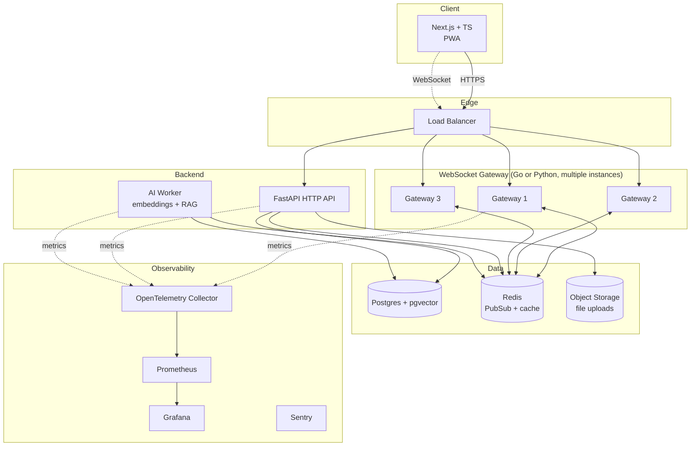

# chat-engine — Product Plan

> This is the product brief for the Realtime Chat Platform. It is the long-form source of truth.
> **Agents:** this file is excluded from default context via `.cursorignore`. Reference `docs/BACKLOG.md` (compact, ID-anchored) instead. Grep into this file only when a backlog entry is insufficient.

---

## Target resume bullet

> **Realtime Chat Platform** — *Go · Python · FastAPI · PostgreSQL · pgvector · Redis · Next.js · TypeScript · Docker · Fly.io*
> Built a horizontally-scalable real-time messaging platform handling 10K+ concurrent WebSocket connections with sub-100ms P99 message latency. Implemented AI-assisted threads with retrieval-augmented generation over message history, semantic search via pgvector embeddings, and presence/typing indicators backed by Redis Pub/Sub fan-out across multiple gateway instances. Production-grade observability with OpenTelemetry, Prometheus, Grafana, and Sentry; CI/CD via GitHub Actions with preview deploys and end-to-end Playwright tests.
> *Live demo · GitHub · [Engineering blog post]*

---

## High-level architecture

---

## Tech stack rationale

| Layer | Choice | Why |
|---|---|---|
| Backend API | FastAPI (Python) | Async-first, strong AI ecosystem, production-proven |
| Database | Postgres 16 + pgvector | Source of truth + vector store in one system |
| Cache / Pub-Sub | Redis 7 | Pub/Sub fan-out, presence TTL, rate limiting, embedding cache |
| Background work | arq | Async-native, Redis-backed, lighter than Celery |
| Frontend | Next.js 15 (App Router) + TypeScript | Industry-standard stack, SSR, App Router DX |
| UI | shadcn/ui + Tailwind | Accessible primitives, fast to iterate |
| Auth | Auth.js (NextAuth v5) | GitHub + Google OAuth; JWT sessions usable by backend |
| WebSocket scale | Python now, optional Go later | Python enough for ~10K; Go hits 100K+ per node |
| Object storage | Cloudflare R2 | S3-compatible, no egress fees, generous free tier |
| Observability | OpenTelemetry + Prometheus + Grafana | Traces, metrics, dashboards in one stack |
| Errors | Sentry | Free tier, 10 min setup, interview talking point |
| Deployment | Fly.io | Free tier Postgres + Redis, real domain, simple CLI |
| CI/CD | GitHub Actions | Preview deploys per PR, matrix tests |
| Load testing | k6 | Generates real numbers for resume bullet |

---

## 10-phase roadmap

### Phase 1 — Modern foundation *(~2 weeks)*
- Monorepo: `backend/`, `frontend/`, `infra/`.
- Postgres + SQLModel + Alembic. Schema: `users`, `channels`, `memberships`, `messages`, `attachments`.
- FastAPI HTTP API: REST for channels and message history.
- `ConnectionManager` persists messages before broadcasting.
- Next.js 15 App Router + TypeScript + Tailwind + shadcn/ui + TanStack Query.
- `docker-compose.yml` for Postgres + Redis.
- **End-state:** messages persist across server restarts; modern frontend renders them.

### Phase 2 — Real product UX *(~2 weeks)*
- Auth.js with GitHub + Google OAuth. JWT validated on WebSocket handshake.
- Multiple channels + sidebar + DMs (channels with `is_dm=true`).
- Optimistic UI, infinite-scroll history, WebSocket reconnect with gap-fill.
- Typing indicators + presence via Redis TTL.
- Mobile-responsive layout.
- **End-state:** indistinguishable from a basic Slack.

### Phase 3 — AI layer *(~2 weeks)*
- pgvector enabled. `embedding vector(1536)` on `messages`.
- arq worker: embedding pipeline (every new message → `text-embedding-3-small`).
- Semantic search: `Cmd+K` command palette, debounced query, ranked results, click-to-jump.
- `@assistant` RAG: embed question → top-K from pgvector → LLM stream → WebSocket chunks.
- Thread summarization. Daily digest (personalized, AI-judged relevance).
- **End-state:** search a year of fake messages instantly; `@assistant` answers questions using past conversations as context.

### Phase 4 — Horizontal scale *(~2 weeks)*
- Redis Pub/Sub fan-out: every gateway subscribes to `chat:{channel_id}`, broadcasts locally on receive.
- Stateless gateways → round-robin LB, no sticky sessions.
- Optional Go gateway for 100K+ connections per node.
- Connection draining + backpressure.
- k6 load tests: 10K connections, P99 < 200ms, real numbers in the bullet.
- asyncpg pool, read replica, Redis cache for hot reads.
- **End-state:** kill a gateway, clients reconnect, conversation continues. Grafana shows 10K connections.

### Phase 5 — Observability *(~1.5 weeks)*
- OpenTelemetry: traces end-to-end (HTTP → DB → Redis → OpenAI).
- Prometheus metrics: connections, latency histograms, queue depth, error rates.
- Grafana dashboards: Overview, Latency, AI Worker, Database.
- Sentry on frontend + backend + worker.
- Structured JSON logging with correlation IDs.
- `/health` + `/ready` probes. SLOs in Grafana.
- **End-state:** click a trace, follow it through every service.

### Phase 6 — Product feature completeness *(~2 weeks)*
- Message reactions, threads/replies, mentions + notifications.
- File uploads to Cloudflare R2 via pre-signed URLs. Image/video previews.
- Edit/delete history, read receipts, unread badges.
- Redis-based rate limiting.
- Admin/moderation: kick/ban, pin messages, moderation log.
- Slash commands: `/giphy`, `/poll`, `/remind` (extensible registry).

### Phase 7 — PWA + offline *(~1 week)*
- PWA manifest + install prompt.
- Service Worker: cache-first for static assets, network-first for API.
- IndexedDB for last 100 messages per channel.
- Offline send queue with idempotency key; flush and dedupe on reconnect.

### Phase 8 — Testing maturity *(~1 week)*
- pytest ≥70% coverage; factory_boy fixtures; integration tests for all routes.
- Vitest for hooks and utilities. Playwright E2E for critical flows.
- GitHub Actions: parallel lint/typecheck/test/build jobs; matrix Python/Node versions.
- Preview deploys per PR (Fly.io); auto-deploy `main`.
- Renovate for dependency updates.

### Phase 9 — Stretch differentiator *(pick 1–2)*

| Option | Signal | Difficulty |
|---|---|---|
| WebRTC voice/video | Real-time media, signaling | High |
| End-to-end encryption | Security, cryptography | High |
| Federated mode (ActivityPub) | Distributed systems | Very high |
| CRDT collaborative docs | Conflict resolution | High |
| Bot API + plugin system | API design | Medium |
| Multi-tenancy (workspaces) | Auth/isolation | Medium |
| Mobile app (React Native) | Cross-platform | High |
| CLI client | Protocol design | Low |
| Fine-tuned small model | ML/MLOps | High |

**Recommended picks:** WebRTC voice + Bot API/plugin system.

### Phase 10 — Content & outreach *(~1 week focused)*
- Blog posts: "Scaling WebSockets to 10K connections with Redis Pub/Sub", "Semantic chat search with pgvector + RAG", "WebSocket auth patterns that actually work".
- Demo video (3–5 min, QuickTime/Loom, YouTube).
- GIF walkthrough in README.
- `ARCHITECTURE.md` with Mermaid diagrams and engineering decisions.
- Show HN + dev.to + LinkedIn.

---

## Ship checkpoints

| After phase | Resume strength |
|---|---|
| 1–3 | Solid grad-level. Strong but not standout. |
| 1–5 | Standout grad-level. Clearly above average. |
| 1–6 | Senior-grad-level. Top company pipelines. |
| 1–8 | Better than most 2-year engineers. |
| All 10 | Indistinguishable from a small startup's V1. |

**Recommended v1.0 target:** end of Phase 5 + one Phase 9 stretch + Phase 10 content.

---

- [ ] Write section: "Database Schema" — ER diagram (generate with `eralchemy2` or draw manually in Mermaid)
- [ ] Write section: "WebSocket Scaling" — explain the Redis Pub/Sub fan-out pattern with a sequence diagram
- [ ] Write section: "AI Pipeline" — explain the embedding + RAG flow, pgvector choice rationale vs dedicated vector DB (Pinecone, Weaviate)
- [ ] Write section: "Engineering Decisions" — for each major decision: what you chose, what alternatives you considered, why:
  - pgvector vs Pinecone/Weaviate
  - arq vs Celery vs FastAPI BackgroundTasks
  - Auth.js JWTs vs database sessions
  - Go gateway vs Python gateway
  - Cursor-based vs offset-based pagination
  - Optimistic UI: benefits and failure handling
- [ ] Write section: "Load Test Results" — actual k6 numbers, Grafana screenshots
- [ ] Write section: "Performance Characteristics" — `EXPLAIN ANALYZE` outputs for key queries

---

### STORY 12.2 — README polish

**Description**
The README is the landing page of your project. It needs to communicate "serious project" in the first 10 seconds.

**Tasks**
- [ ] Add hero GIF at top (record 15s walkthrough with Kap: join, send message, receive reply, search, use @assistant)
- [ ] Add "Live Demo" link in the first paragraph (Fly.io URL)
- [ ] Add tech stack badges (shields.io) for every major technology
- [ ] Add "Key Features" section with one-line descriptions and emoji (✓ Semantic search ✓ AI-assisted threads ✓ Horizontally scalable …)
- [ ] Add "Architecture" section with the Mermaid diagram from ARCHITECTURE.md
- [ ] Add "Getting Started" section: `git clone`, `cp .env.example .env`, `docker-compose up`, `open localhost:3000` — should work in 4 commands
- [ ] Add "Running Tests" section
- [ ] Add "Deployment" section with link to ARCHITECTURE.md
- [ ] Add CI badge, coverage badge, license badge
- [ ] Add "Engineering Blog Posts" section linking to your posts

---

### STORY 12.3 — Engineering blog posts

**Description**
Write 2–3 technical blog posts about the most interesting engineering problems you solved. These get cross-posted to HN, dev.to, Reddit. Each one is a recruiting artifact that can land you interviews independently of your resume.

**Tasks**
- [ ] Post 1: **"How I scaled WebSockets to 10K connections with Redis Pub/Sub"**
  - Problem: naïve broadcast breaks with multiple server instances
  - Solution: Redis Pub/Sub fan-out, stateless gateways
  - Architecture diagram, code snippets (the relevant parts of ConnectionManager)
  - Load test results and graphs
  - ~1500 words
- [ ] Post 2: **"Building semantic chat search with pgvector and RAG"**
  - Why vector search is fundamentally different from full-text search
  - How to generate and store embeddings efficiently (batching, background worker)
  - The RAG pipeline: retrieval → context construction → streaming response
  - pgvector query with `<=>` operator explained
  - ~1200 words
- [ ] Post 3: **"WebSocket authentication: the patterns that actually work"**
  - Why you can't use HTTP cookies for WebSocket auth in the same way
  - Token-in-query-param vs first-message auth vs HTTP upgrade header
  - What you chose and why, with code
  - Reconnection and token expiry handling
  - ~1000 words
- [ ] Publish on personal blog (Ghost or Hashnode free tier give you a clean domain)
- [ ] Cross-post to dev.to, HN "Ask HN: I built X" format, Reddit /r/programming

---

### STORY 12.4 — Demo video

**Description**
Record a 3–5 minute narrated walkthrough of the application. This goes on YouTube, linked from the resume, and in the README. Recruiters who click it should come away thinking "this is a real, polished app."

**Tasks**
- [ ] Seed the DB with realistic fake data (Faker) — at least 500 messages across 5 channels, 10 users — so the demo doesn't look empty
- [ ] Write a script for the walkthrough:
  1. Sign in with GitHub (10s)
  2. Show channel sidebar, switch channels (15s)
  3. Send a message, show it appear on a second browser (15s)
  4. Show typing indicator from the second browser (10s)
  5. Show semantic search (Cmd+K) with a non-obvious query (20s)
  6. Use `@assistant` and show streaming response (30s)
  7. Show file upload with image preview (15s)
  8. Open Grafana dashboard briefly — active connections, latency (15s)
- [ ] Record with QuickTime or Loom, narrate over it
- [ ] Upload to YouTube (unlisted or public)
- [ ] Add link to README and resume

---

That's the full list — 12 epics, ~45 stories, ~300 tasks. To use any story description as an AI agent prompt, copy the **Description** paragraph and add "The current codebase is at [repo path]. Implement this story. Here is the current server.py: [paste file]." The descriptions are written to be self-contained for exactly that purpose.

A good order to work through them is the epic order as written: Epics 1–3 first (foundation + messaging + auth), then 4 (real-time polish), then 5 (AI), then 6 (scaling), then 7 (observability), then 8–9 (product features), then 10–12 (tests, deploy, portfolio). Within each epic, do the stories in the order listed.

