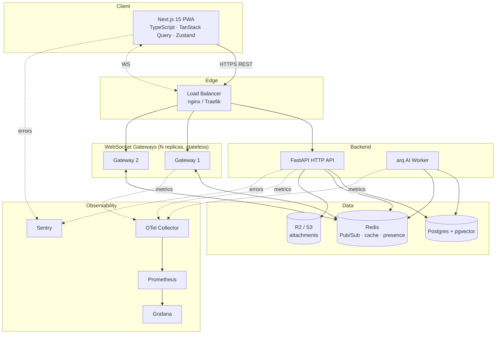
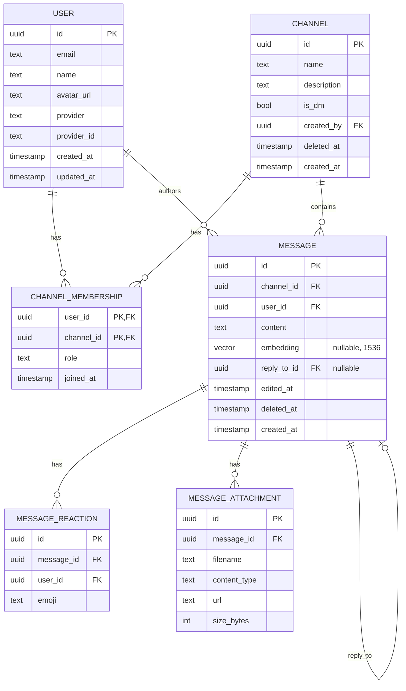
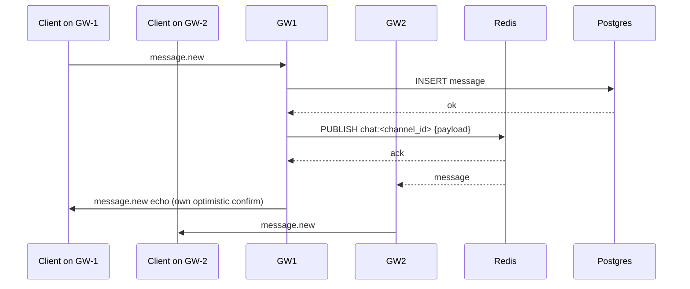
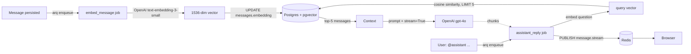

# ARCHITECTURE — chat-engine

> Target architecture (what we are building toward, per `chat-plan.md`). Sections marked **planned** are not yet implemented; see `docs/PROGRESS.md` for live state.

---

## System overview



In the current single-instance state, "Gateway" and "API" are the same Python process. Epic 6 (`S6.1`) splits the WebSocket plane behind Redis Pub/Sub.

---

## Component responsibilities

| Component         | Responsibility                                                                    | Stack                                 |
| ----------------- | --------------------------------------------------------------------------------- | ------------------------------------- |
| Browser (PWA)     | UI, optimistic updates, offline cache, push notifications                         | Next.js 15, TS, shadcn, TanStack Query|
| HTTP API          | REST reads (channels, messages history, search, auth sync, uploads), admin ops    | FastAPI, asyncpg, SQLModel            |
| WebSocket Gateway | Stateless WS termination, JWT validation, Redis pub/sub fan-out                   | FastAPI now → Go later (`S6.2`)       |
| AI Worker         | Embedding generation, `@assistant` RAG, summarization, daily digest               | arq, OpenAI, tenacity                 |
| Postgres          | Source of truth: users, channels, memberships, messages (+ vector embeddings), reactions, attachments, notifications | Postgres 16 + pgvector |
| Redis             | Pub/Sub broadcast, sliding-window rate limit, presence TTL keys, query embedding cache, hot-read cache | Redis 7 |
| R2 / S3           | Attachment storage; clients PUT via pre-signed URLs                               | Cloudflare R2 (S3 API)                |

---

## Data model (current)



Tables added later: `notifications` (`S8.4`), `banned_users`, `pinned_messages`, `moderation_log` (`S8.6`), `poll_options`, `poll_votes` (`S8.5`).

---

## WebSocket protocol

All messages are JSON: `{ "type": <WSMessageType>, "payload": <object> }`.

| Type                | Direction        | Payload                                                            |
| ------------------- | ---------------- | ------------------------------------------------------------------ |
| `message.new`       | client ↔ server  | `{ content, reply_to_id? }`                                        |
| `message.edit`      | client ↔ server  | `{ message_id, content }`                                          |
| `message.delete`    | client ↔ server  | `{ message_id }`                                                   |
| `message.reaction`  | client ↔ server  | `{ message_id, emoji }`                                            |
| `message.stream`    | server → client  | `{ message_id, chunk, done }` (assistant streaming)                |
| `typing.start`      | client ↔ server  | `{ user_id, channel_id }`                                          |
| `typing.stop`       | client ↔ server  | `{ user_id, channel_id }`                                          |
| `presence.join`     | server → client  | `{ user_id, channel_id }`                                          |
| `presence.leave`    | server → client  | `{ user_id, channel_id }`                                          |
| `presence.snapshot` | server → client  | `{ online_user_ids: [...] }`                                       |
| `notification.new`  | server → client  | `{ notification_id, type, message_id }`                            |
| `error`             | server → client  | `{ message }`                                                      |

Connection URL: `WS /ws/{channel_id}?token=<jwt>`. Server **must** authenticate and authorize before `ws.accept()`. Auth failure closes with code `4001`.

---

## WebSocket scaling (planned — `S6.1`)



Each gateway maintains a refcount per channel of local subscribers. When the first local client joins, the gateway subscribes to `chat:<channel_id>`; when the last leaves, it unsubscribes. Stateless: any gateway can serve any user → round-robin LB, no sticky sessions.

---

## AI pipeline (planned — Epic 5)



---

## Engineering decisions

| Decision                              | Choice                              | Why                                                                                                                            |
| ------------------------------------- | ----------------------------------- | ------------------------------------------------------------------------------------------------------------------------------ |
| Vector store                          | **pgvector** (extension on Postgres)| Single source of truth; no second system to operate; performance is adequate up to tens of millions of vectors.                |
| Background work                       | **arq**                             | Async-native (no thread overhead like Celery), small surface area, Redis-backed (we already run Redis).                       |
| WebSocket auth                        | **JWT in `?token=` query param**    | Cookies aren't always sent on cross-origin WS upgrades; first-message auth adds a round trip; query param works everywhere with HTTPS. |
| Session storage                       | **JWT only**, no DB session table   | Stateless backend; gateway can validate without a DB hit; refresh handled by NextAuth.                                         |
| Gateway language                      | **Python now, Go later (`S6.2`)**   | Python is enough until ~10K connections; Go gives 10× density per node when needed.                                            |
| Pagination                            | **Cursor (`?before=<uuid>`)**       | Stable under concurrent writes; offset pagination shifts rows when new messages arrive.                                        |
| Frontend state                        | **TanStack Query + Zustand**        | TQ for server state with optimistic updates + cache; Zustand for tiny client-only stores (no Redux ceremony).                  |
| Soft delete                           | **`deleted_at` column**             | Preserves audit trail and lets us undo accidental deletes; reads always filter `deleted_at IS NULL`.                           |
| Migrations                            | **Alembic, async, append-only**     | Standard for SQLAlchemy; never edit a merged revision (creates merge-conflict landmines).                                      |
| Real-time scaling                     | **Redis Pub/Sub fan-out**           | Stateless gateways behind round-robin LB; no sticky sessions; trivial horizontal scale.                                        |
| File uploads                          | **Pre-signed PUT to R2**            | Files never traverse our servers; R2 has no egress fees.                                                                       |

---

## Non-functional targets

| Property                          | Target                                |
| --------------------------------- | ------------------------------------- |
| P50 broadcast latency             | <50 ms                                |
| P99 broadcast latency             | <200 ms                               |
| Concurrent WS connections (Py)    | 10K (single replica)                  |
| Concurrent WS connections (Go)    | 100K (single replica) — `S6.2`        |
| Test coverage (backend)           | ≥70% lines                            |
| CI wall time                      | <5 minutes                            |
| Postgres write IOPS               | <500 sustained                        |
| Sentry trace sample rate          | 20% (prod)                            |

These are tracked in Grafana (`S7.3`) and validated by k6 (`S6.4`).

---

## Local environment

`docker-compose.yml` runs the full stack — Postgres, Redis, backend (FastAPI + Alembic migrations on startup), and frontend (Next.js dev server). A single `docker compose up` is all that is needed.

```
docker compose up
```

Services start in dependency order: Postgres & Redis first (healthchecked), then backend (runs `alembic upgrade head` before starting uvicorn with `--reload`), then frontend (`next dev` with source code bind-mounted for hot reload).

Alternatively, run only infrastructure in Docker and the application services on the host for a lighter dev loop:

```bash
docker compose up -d postgres redis
make -C backend install && make dev-backend
make -C frontend install && make dev-frontend
```

Dockerfiles live at `backend/Dockerfile` and `frontend/Dockerfile` (multi-stage, non-root runtime user).

Optional `--profile observability` brings up Prometheus, Grafana, OTel collector, Jaeger (Epic 7 — not yet wired).

Port reservations are listed in `infra/AGENTS.md`.
